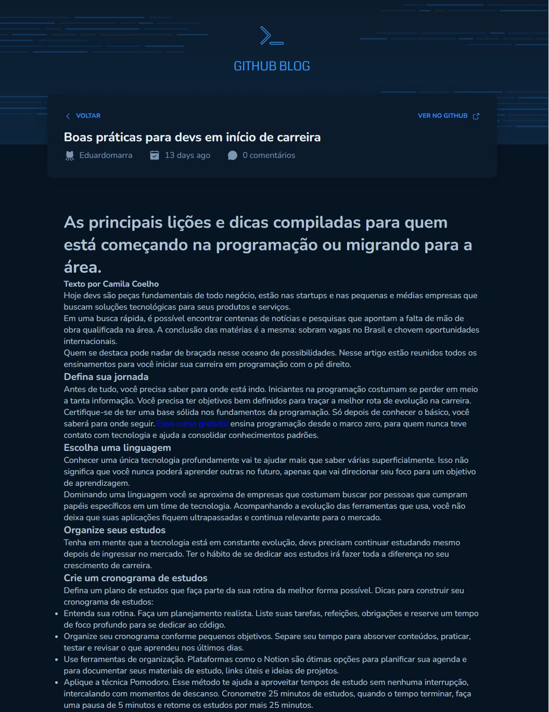

# Desafio Ignite

  

  

## 💻 Sobre o projeto

---

<a href="https://github-blog-emarra.vercel.app/" target="_blank">Versão online</a>

Desafio Rocketseat - Ignite ReactJs .

## 🚀 Tecnologias

---

Esse projeto foi desenvolvido com as seguintes tecnologias:

- ReactJS (create vite@latest)
- Typescript
- Styled-Components
- React-hook-form
- zod
- Deploy realizado na Vercel

### Rodando localmente

---

1. Instalar todos os pacotes com `yarn install`
2. Executar o comando `yarn dev`
<<<<<<< HEAD
3. Em alguns seguntos a URL: `http://localhost:3000/` ficará disponível
=======
3. Em alguns seguntos a URL: `http://localhost:3000/` ficará disponível
>>>>>>> b4415591c81f909b9cdc4f5ebb148f186e061229
